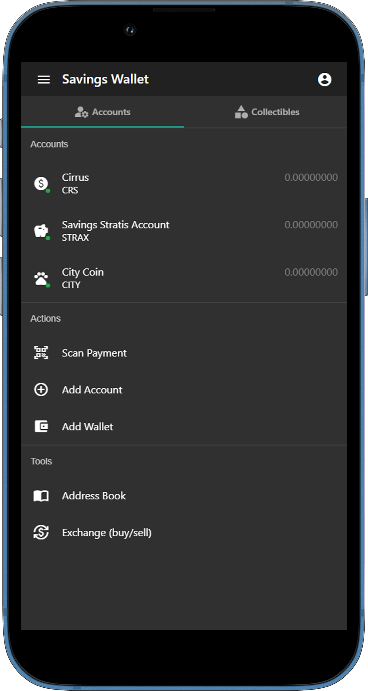

## Blockcore Wallet

The **Blockcore Wallet** is a versatile, non-custodial, open-source cryptocurrency wallet designed to provide secure and easy management of your digital assets. Built on the principles of decentralization, the wallet ensures that you maintain full control over your private keys and funds while offering a seamless and intuitive user experience.

### Key Features

1. **Non-Custodial Security**: 
   - Your private keys are never stored on centralized servers. With Blockcore Wallet, you are the sole owner of your keys and funds, ensuring maximum privacy and security.

2. **Multi-Currency Support**: 
   - Blockcore Wallet supports a wide range of cryptocurrencies, including all assets on Blockcore-based blockchains and major cryptocurrencies like Bitcoin. Manage multiple assets within a single wallet interface.

3. **User-Friendly Interface**: 
   - Designed with simplicity in mind, Blockcore Wallet offers an intuitive interface that makes managing your digital assets easy, whether you are a beginner or an experienced user.

4. **Cross-Platform Compatibility**: 
   - Access your wallet across various platforms, including web, browser extension, and mobile devices. Blockcore Wallet provides a seamless experience whether you're at home or on the go.

5. **Advanced Security Features**: 
   - Benefit from multi-signature support, biometric authentication, and hardware wallet integration. These features enhance the security of your assets, protecting them from unauthorized access.

6. **Decentralized Identity (DID) Integration**: 
   - Manage your digital identity alongside your assets with Blockcore’s support for Decentralized Identifiers (DIDs). Secure authentication and verifiable credentials are built into the wallet.

7. **Open Source and Community-Driven**: 
   - As an open-source project, Blockcore Wallet is transparent and encourages community contributions. The wallet's code is publicly available for review and improvement by developers worldwide.

### Download Blockcore Wallet

Blockcore Wallet is available across multiple platforms. Choose your preferred platform and start managing your digital assets securely:

- **Web Application**: [Access Now](https://wallet.blockcore.net)
- **Browser Extension**: 
  - [Download for Chrome](https://chromewebstore.google.com/detail/blockcore-wallet/peigonhbenoefaeplkpalmafieegnapj)
 

### Getting Started

#### 1. Download and Install
- **Web**: Use the [web version](https://wallet.blockcore.net) directly from your browser.
- **Browser Extensions**: Install the wallet as an extension in Chrome for easy access and management.

#### 2. Create or Restore a Wallet
- **Create a New Wallet**: Upon launching the wallet, you can create a new wallet. You will be prompted to save a recovery phrase. This phrase is crucial for recovering your wallet, so store it securely.
- **Restore an Existing Wallet**: If you already have a wallet, you can restore it using the recovery phrase by selecting the 'Restore Wallet' option.

#### 3. Add Cryptocurrencies
- Navigate to the "Assets" section in your wallet and select "Add Currency". Blockcore Wallet supports various cryptocurrencies, and you can manage multiple assets within the same wallet interface.

#### 4. Send and Receive Assets
- **Receive**: To receive cryptocurrency, go to the "Receive" section, where you can generate a new address or use an existing one. Share this address with the sender.
- **Send**: To send cryptocurrency, go to the "Send" section, enter the recipient’s address, amount, and confirm the transaction. The wallet will locally sign the transaction before broadcasting it to the network.

#### 5. Explore Advanced Features
- **Multi-Signature Transactions**: For enhanced security, set up multi-signature transactions, which require multiple approvals before execution.
- **Decentralized Identifiers (DID)**: Manage your decentralized identity directly from the wallet, enabling secure interactions with various services.
- **Hardware Wallet Integration**: Connect your hardware wallet for additional security and manage your assets with confidence.

### How It Works

- **Private Key Management**: 
  - Your private key is generated and stored securely on your device. Blockcore does not have access to your private keys, ensuring that only you control your funds.

- **Transaction Signing**:
  - Transactions are signed locally on your device using your private key before being broadcast to the blockchain, ensuring maximum security.

- **Multi-Signature Transactions**:
  - Blockcore Wallet supports multi-signature transactions, allowing multiple parties to authorize transactions, adding an extra layer of security.

- **DID and Verifiable Credentials**:
  - Blockcore Wallet integrates with Decentralized Identifiers (DIDs) and verifiable credentials, enabling secure management of digital identities and credentials alongside your assets.

### Security Best Practices

- **Backup Your Recovery Phrase**:
  - Always securely back up your recovery phrase and store it in multiple locations if possible. This phrase is the only way to recover your wallet if you lose access to your device.

- **Enable Biometric Authentication**:
  - On mobile devices, enable biometric authentication to add an extra layer of security to your wallet.

- **Use Multi-Signature Transactions**:
  - For high-value transactions, consider setting up multi-signature wallets that require multiple parties to approve transactions.

- **Regularly Update the Wallet**:
  - Ensure that your Blockcore Wallet is always up to date with the latest security patches and features.

### Community and Support

Join the Blockcore community to connect with other users, developers, and contributors. Share your experiences, ask questions, and collaborate on new features:

- **[Blockcore GitHub Discussions](https://github.com/block-core/blockcore/discussions)**
- **[Blockcore Discord Server](https://discord.blockcore.net)**
 

### Conclusion

Blockcore Wallet is a powerful, secure, and user-friendly tool for managing your digital assets. With its open-source nature, community-driven development, and robust security features, it is the ideal choice for both individual users and organizations seeking a reliable wallet solution. Start your journey with Blockcore Wallet today and experience the future of decentralized finance.

_Last updated_: August 31, 2024
